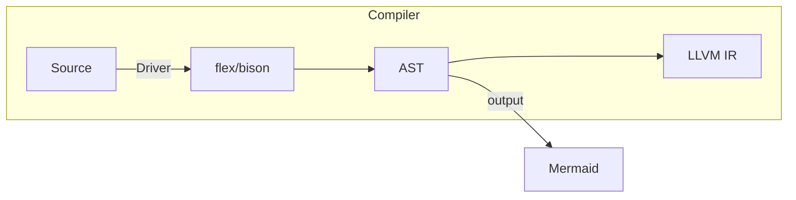

# pipeline

# 抽象语法树设计
**抽象语法树(Abstrct Syntax Tree, AST)**
- 命名空间: Compiler::AbstractSyntaxTree
- 基类: Compiler::AbstractSyntaxTree::Node
## 基类: Compiler::Node
1. 空类, 用于标识AST的基类
2. 类似interface,每个AST节点都需要继承该类
std::unique_ptr\<Compiler::AbstractSyntaxTree::Node> ast = std::make_unique\<Compiler::AbstractSyntaxTree::Statement>();
3. 成员变量
    - std::uniqe_ptr\<Compiler::AbstractSyntaxTree::Generator> generator

# 类: Compiler::AbstractSyntaxTree::Generator
