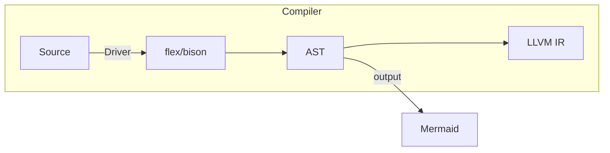
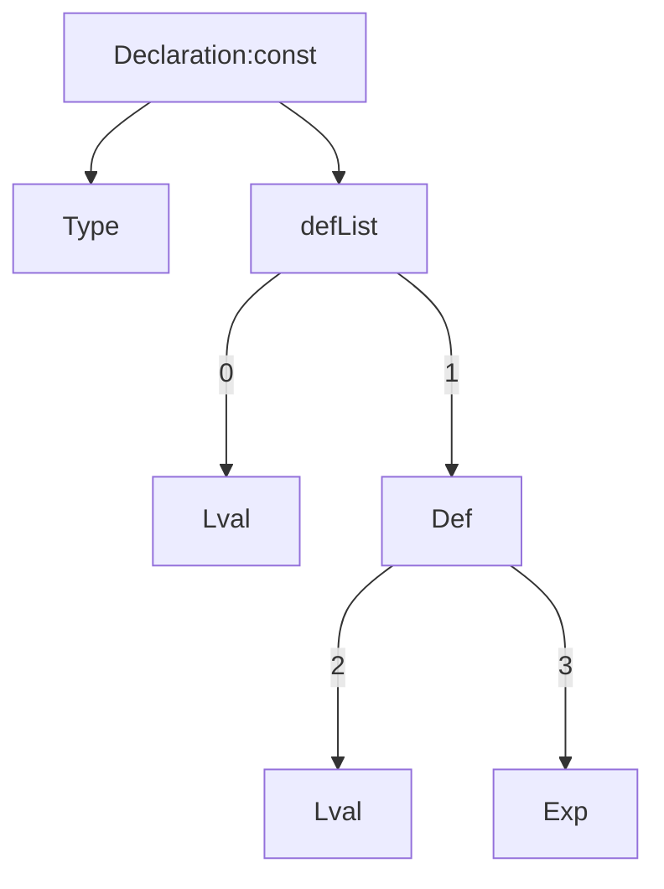

# pipeline



# CompUnit

一个SysY程序由单个文件组成

一个SysY程序由若干个全局变量声明和若干个函数定义组成

自顶向下地看，所以我们可以将一个编译单元看作若干个小单元

每一个小单元可能是以下几种之一：

- Declaration

- FuncDef

必须存在且仅存在一个标识为 ‘main’ 、无参数、返回类型为 int 的 FuncDef(函数定义)

<!-- 语义分析 -->
所以最后的编译单元一定是
```c
int main(){
    ...
}
```

# Declaration

词法分析后Declaration的一般结构为



修饰符const是可选的

语义分析步骤

1. 若修饰符const存在，则检查defList中的所有元素都是Def, 若出现非Def元素则报错

2. 对每个Lval进行语义分析

3. 若修饰符const存在，
3.1 若Type为int，检查Exp是Int32类型，此时该Exp应先进行语义分析（这里指如果是常量表达式，应该进行计算）
3.2 若Type为float，检查Exp是Float类型，此时该Exp应先进行语义分析（这里指如果是常量表达式，应该进行计算）

# 左值

