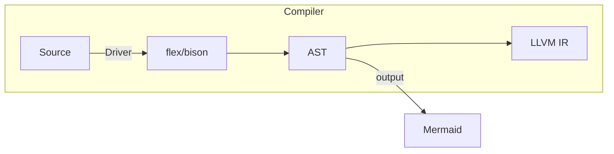

# pipeline



# CompUnit

一个SysY程序由单个文件组成

一个SysY程序由若干个全局变量声明和若干个函数定义组成

自顶向下地看，所以我们可以将一个编译单元看作若干个小单元

每一个小单元可能是以下几种之一：

- Declaration

- FuncDef

必须存在且仅存在一个标识为 ‘main’ 、无参数、返回类型为 int 的 FuncDef(函数定义)

<!-- 语义分析 -->
所以最后的编译单元一定是
```c
int main(){
    ...
}
```


