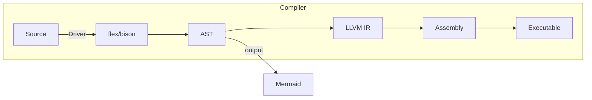
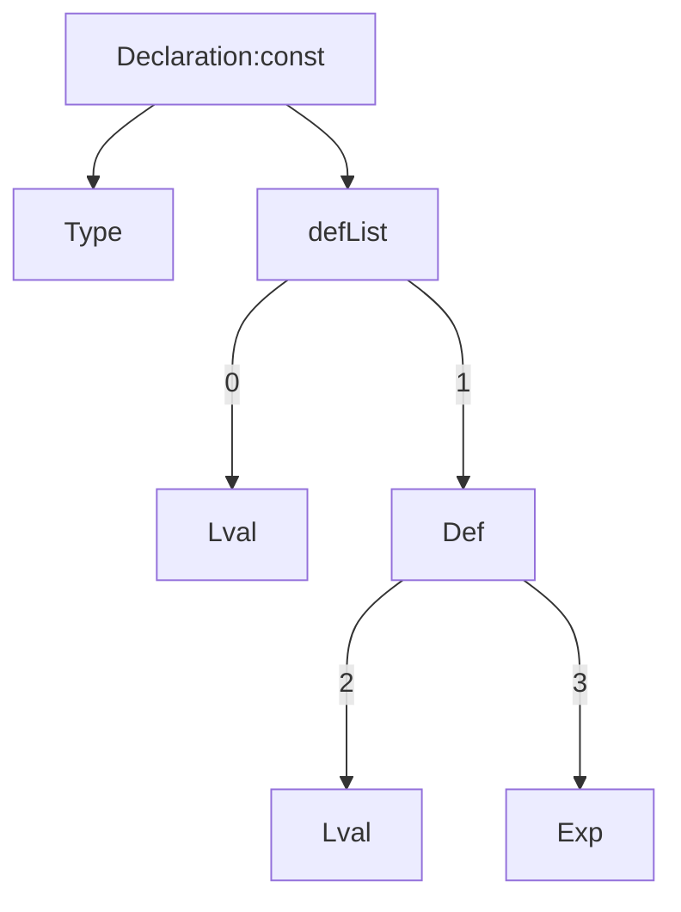

# pipeline


# 词法分析(待重新总结)

## CompUnit

一个SysY程序由单个文件组成

一个SysY程序由若干个全局变量声明和若干个函数定义组成

自顶向下地看，所以我们可以将一个编译单元看作若干个小单元

每一个小单元可能是以下几种之一：

- Declaration

- FuncDef

必须存在且仅存在一个标识为 ‘main’ 、无参数、返回类型为 int 的 FuncDef(函数定义)

<!-- 语义分析 -->
所以最后的编译单元一定是
```c
int main(){
    ...
}
```

## Declaration

词法分析后Declaration的一般结构为



修饰符const是可选的

语义分析步骤

### const

1. 若修饰符const存在，则检查defList中的所有元素都是Def, 若出现非Def元素则报错

2. 检查ident是否已经在符号表中，若已存在则报错

3. 对Def进行语义分析
3.1 若Type为int，检查Exp是Int32类型，此时该Exp应先进行语义分析（这里指如果是常量表达式，应该进行计算）
3.2 若Type为float，检查Exp是Float类型，此时该Exp应先进行语义分析（这里指如果是常量表达式，应该进行计算）

4. 将该常量加入符号表，记录其类型和值，分配地址，若已存在则报错

### non-const

2. 将该变量加入符号表，记录其类型，分配地址，若已存在则报错

3. 如果是Def,对Def进行语义分析
3.1 若Type为int，检查Exp是Int32类型，此时该Exp应先进行语义分析
3.2 若Type为float，检查Exp是Float类型，此时该Exp应先进行语义分析

### 左值

检查ident是否已经在符号表中，若已存在则报错


# 测试用例

## Stage1

以S1-开头

1. 结果是否正确，检查结果是否符合预期
1.1 有无全局变量 0是没有，1是有
1.2 声明时是否初始化 0是没有，1是有

2. 有无报错，检查报错信息是否符合预期
2.1 编译单元最后一个必须是函数定义
2.2 编译单元最后一个函数定义必须是main函数
2.3 编译单元最后一个函数定义的返回类型必须是int
2.4 编译单元最后一个函数定义的参数列表必须为空
2.5 常量必须初始化
2.6 常量不能被赋值
2.7 该变量已经被声明
2.8 该变量还未被声明

比如S1-error-1-123
就是Stage1的检查"编译单元最后一个必须是函数定义"的报错信息是否正常的123号测试用例


---

*实现的内容*：

### int32类型

32位的整数类型，*TODO* 边界条件未测试

### 变量声明

### 变量初始化

### 变量赋值

### 常量声明

### 常量初始化

### 常量赋值

### 表达式

### return语句

### 常量折叠+常量传播

### 语法错误
