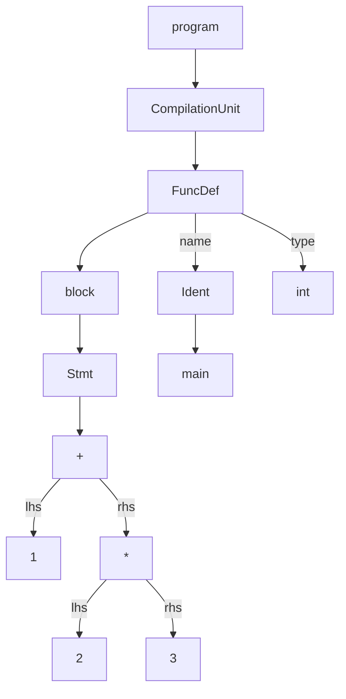
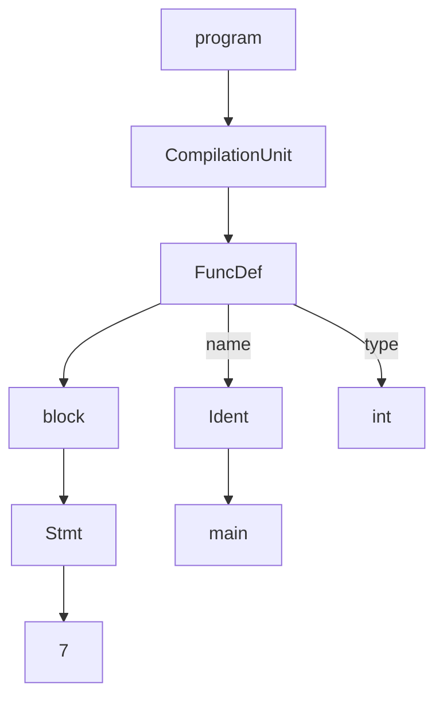

```mermaid
graph TD
11[program]
11-->10
10[CompilationUnit]
10-->9
9[FuncDef]
9--type-->int
9--name-->1
1[Ident]
1-->main
9-->8
8[block]
8-->7
7[Stmt]
7-->6
6["+"]
6--lhs-->2
6--rhs-->5
2[1]
5["*"]
5--lhs-->3
5--rhs-->4
3[2]
4[3]
```

```mermaid
graph TD
11[program]
11-->10
10[CompilationUnit]
10-->9
9[FuncDef]
9--type-->int
9--name-->1
1[Ident]
1-->main
9-->8
8[block]
8-->7
7[Stmt]
7-->15
15[7]
```
