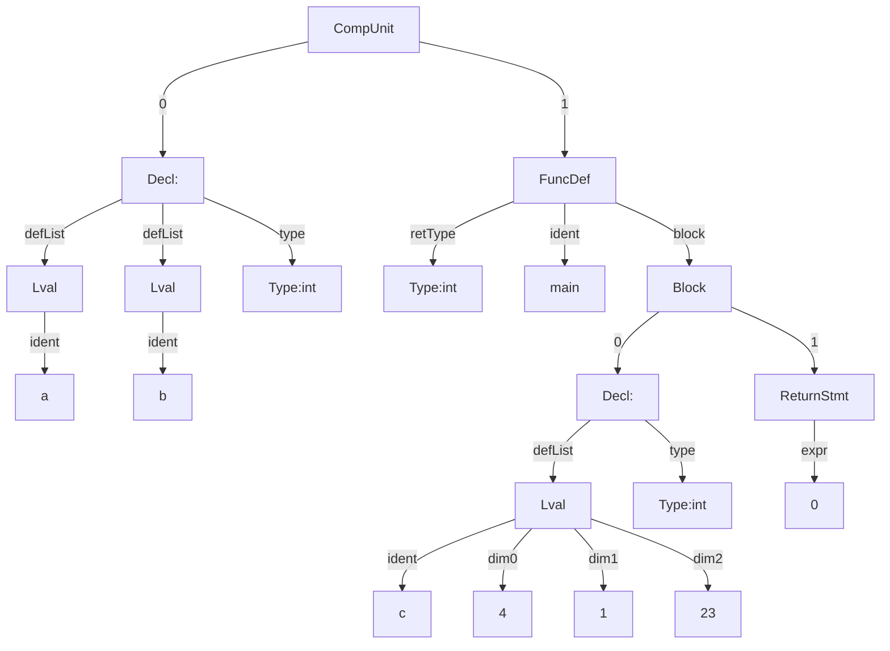

```mermaid
graph TD
27[CompUnit]--0--->5
5[Decl:]
5--type-->6
6[Type:int]
5--defList-->2
2[Lval]
2--ident-->1
1[a]
5--defList-->4
4[Lval]
4--ident-->3
3[b]
27[CompUnit]--1--->26
26[FuncDef]
26--retType-->7
7[Type:int]
26--ident-->8
8[main]
26--block-->25
25[Block]
25--0-->21
21[Decl:]
21--type-->22
22[Type:int]
21--defList-->20
20[Lval]
20--ident-->10
10[c]
20--dim0-->13
13[4]
20--dim1-->14
14[1]
20--dim2-->19
19[23]
25--1-->24
24[ReturnStmt]
24--expr-->23
23[0]
```
