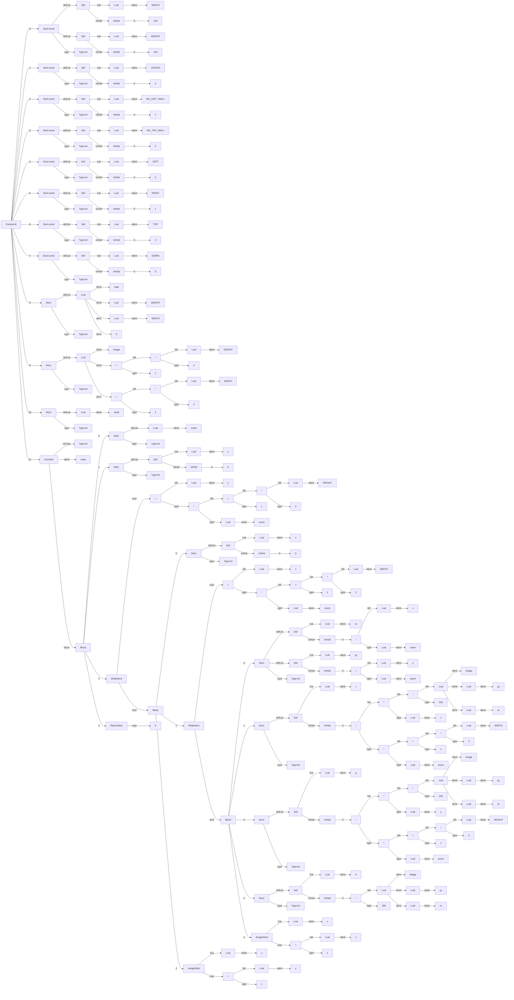

```mermaid
graph LR
262[CompUnit]--0--->11
11[Decl:const ]
11--type-->12
12[Type:int]
11--defList-->5
5[Def]
5--lval-->2
2[Lval]
2--ident-->1
1[WIDTH]
5--initVal-->4
4[InitVal]
4--0-->3
3[100]
11--defList-->10
10[Def]
10--lval-->7
7[Lval]
7--ident-->6
6[HEIGHT]
10--initVal-->9
9[InitVal]
9--0-->8
8[100]
262[CompUnit]--1--->19
19[Decl:const ]
19--type-->20
20[Type:int]
19--defList-->18
18[Def]
18--lval-->15
15[Lval]
15--ident-->14
14[VISITED]
18--initVal-->17
17[InitVal]
17--0-->16
16[0]
262[CompUnit]--2--->27
27[Decl:const ]
27--type-->28
28[Type:int]
27--defList-->26
26[Def]
26--lval-->23
23[Lval]
23--ident-->22
22[NO_LEFT_WALL]
26--initVal-->25
25[InitVal]
25--0-->24
24[1]
262[CompUnit]--3--->35
35[Decl:const ]
35--type-->36
36[Type:int]
35--defList-->34
34[Def]
34--lval-->31
31[Lval]
31--ident-->30
30[NO_TOP_WALL]
34--initVal-->33
33[InitVal]
33--0-->32
32[2]
262[CompUnit]--4--->43
43[Decl:const ]
43--type-->44
44[Type:int]
43--defList-->42
42[Def]
42--lval-->39
39[Lval]
39--ident-->38
38[LEFT]
42--initVal-->41
41[InitVal]
41--0-->40
40[0]
262[CompUnit]--5--->51
51[Decl:const ]
51--type-->52
52[Type:int]
51--defList-->50
50[Def]
50--lval-->47
47[Lval]
47--ident-->46
46[RIGHT]
50--initVal-->49
49[InitVal]
49--0-->48
48[1]
262[CompUnit]--6--->59
59[Decl:const ]
59--type-->60
60[Type:int]
59--defList-->58
58[Def]
58--lval-->55
55[Lval]
55--ident-->54
54[TOP]
58--initVal-->57
57[InitVal]
57--0-->56
56[2]
262[CompUnit]--7--->67
67[Decl:const ]
67--type-->68
68[Type:int]
67--defList-->66
66[Def]
66--lval-->63
63[Lval]
63--ident-->62
62[DOWN]
66--initVal-->65
65[InitVal]
65--0-->64
64[3]
262[CompUnit]--8--->77
77[Decl:]
77--type-->78
78[Type:int]
77--defList-->76
76[Lval]
76--ident-->70
70[map]
76--dim0-->72
72[Lval]
72--ident-->71
71[HEIGHT]
76--dim1-->74
74[Lval]
74--ident-->73
73[WIDTH]
76--dim2-->75
75[3]
262[CompUnit]--9--->94
94[Decl:]
94--type-->95
95[Type:int]
94--defList-->93
93[Lval]
93--ident-->80
80[image]
93--dim0-->86
86["+"]
86--left-->84
84["*"]
84--left-->82
82[Lval]
82--ident-->81
81[HEIGHT]
84--right-->83
83[2]
86--right-->85
85[1]
93--dim1-->92
92["+"]
92--left-->90
90["*"]
90--left-->88
88[Lval]
88--ident-->87
87[WIDTH]
90--right-->89
89[2]
92--right-->91
91[1]
262[CompUnit]--10--->99
99[Decl:]
99--type-->100
100[Type:int]
99--defList-->98
98[Lval]
98--ident-->97
97[seed]
262[CompUnit]--11--->261
261[FuncDef]
261--retType-->101
101[Type:int]
261--ident-->102
102[main]
261--block-->260
260[Block]
260--0-->106
106[Decl:]
106--type-->107
107[Type:int]
106--defList-->105
105[Lval]
105--ident-->104
104[zoom]
260--1-->114
114[Decl:]
114--type-->115
115[Type:int]
114--defList-->113
113[Def]
113--lval-->110
110[Lval]
110--ident-->109
109[y]
113--initVal-->112
112[InitVal]
112--0-->111
111[0]
260--2-->257
257[WhileStmt]
257--expr-->127
127["<"]
127--left-->117
117[Lval]
117--ident-->116
116[y]
127--right-->126
126["*"]
126--left-->123
123["+"]
123--left-->121
121["*"]
121--left-->119
119[Lval]
119--ident-->118
118[HEIGHT]
121--right-->120
120[2]
123--right-->122
122[1]
126--right-->125
125[Lval]
125--ident-->124
124[zoom]
257--stmt-->256
256[Block]
256--0-->134
134[Decl:]
134--type-->135
135[Type:int]
134--defList-->133
133[Def]
133--lval-->130
130[Lval]
130--ident-->129
129[x]
133--initVal-->132
132[InitVal]
132--0-->131
131[0]
256--1-->248
248[WhileStmt]
248--expr-->147
147["<"]
147--left-->137
137[Lval]
137--ident-->136
136[x]
147--right-->146
146["*"]
146--left-->143
143["+"]
143--left-->141
141["*"]
141--left-->139
139[Lval]
139--ident-->138
138[WIDTH]
141--right-->140
140[2]
143--right-->142
142[1]
146--right-->145
145[Lval]
145--ident-->144
144[zoom]
248--stmt-->247
247[Block]
247--0-->167
167[Decl:]
167--type-->168
168[Type:int]
167--defList-->157
157[Def]
157--lval-->150
150[Lval]
150--ident-->149
149[xx]
157--initVal-->156
156[InitVal]
156--0-->155
155["/"]
155--left-->152
152[Lval]
152--ident-->151
151[x]
155--right-->154
154[Lval]
154--ident-->153
153[zoom]
167--defList-->166
166[Def]
166--lval-->159
159[Lval]
159--ident-->158
158[yy]
166--initVal-->165
165[InitVal]
165--0-->164
164["/"]
164--left-->161
161[Lval]
161--ident-->160
160[y]
164--right-->163
163[Lval]
163--ident-->162
162[zoom]
247--1-->195
195[Decl:]
195--type-->196
196[Type:int]
195--defList-->194
194[Def]
194--lval-->171
171[Lval]
171--ident-->170
170[r]
194--initVal-->193
193[InitVal]
193--0-->192
192["/"]
192--left-->182
182["*"]
182--left-->179
179["*"]
179--left-->177
177[Lval]
177--ident-->172
172[image]
177--dim0-->174
174[Lval]
174--ident-->173
173[yy]
177--dim1-->176
176[Lval]
176--ident-->175
175[xx]
179--right-->178
178[255]
182--right-->181
181[Lval]
181--ident-->180
180[x]
192--right-->191
191["*"]
191--left-->188
188["+"]
188--left-->186
186["*"]
186--left-->184
184[Lval]
184--ident-->183
183[WIDTH]
186--right-->185
185[2]
188--right-->187
187[1]
191--right-->190
190[Lval]
190--ident-->189
189[zoom]
247--2-->223
223[Decl:]
223--type-->224
224[Type:int]
223--defList-->222
222[Def]
222--lval-->199
199[Lval]
199--ident-->198
198[g]
222--initVal-->221
221[InitVal]
221--0-->220
220["/"]
220--left-->210
210["*"]
210--left-->207
207["*"]
207--left-->205
205[Lval]
205--ident-->200
200[image]
205--dim0-->202
202[Lval]
202--ident-->201
201[yy]
205--dim1-->204
204[Lval]
204--ident-->203
203[xx]
207--right-->206
206[255]
210--right-->209
209[Lval]
209--ident-->208
208[y]
220--right-->219
219["*"]
219--left-->216
216["+"]
216--left-->214
214["*"]
214--left-->212
212[Lval]
212--ident-->211
211[HEIGHT]
214--right-->213
213[2]
216--right-->215
215[1]
219--right-->218
218[Lval]
218--ident-->217
217[zoom]
247--3-->238
238[Decl:]
238--type-->239
239[Type:int]
238--defList-->237
237[Def]
237--lval-->227
227[Lval]
227--ident-->226
226[b]
237--initVal-->236
236[InitVal]
236--0-->235
235["*"]
235--left-->233
233[Lval]
233--ident-->228
228[image]
233--dim0-->230
230[Lval]
230--ident-->229
229[yy]
233--dim1-->232
232[Lval]
232--ident-->231
231[xx]
235--right-->234
234[255]
247--4-->246
246[AssignStmt]
246--lval-->241
241[Lval]
241--ident-->240
240[x]
246--expr-->245
245["+"]
245--left-->243
243[Lval]
243--ident-->242
242[x]
245--right-->244
244[1]
256--2-->255
255[AssignStmt]
255--lval-->250
250[Lval]
250--ident-->249
249[y]
255--expr-->254
254["+"]
254--left-->252
252[Lval]
252--ident-->251
251[y]
254--right-->253
253[1]
260--3-->259
259[ReturnStmt]
259--expr-->258
258[0]
```
