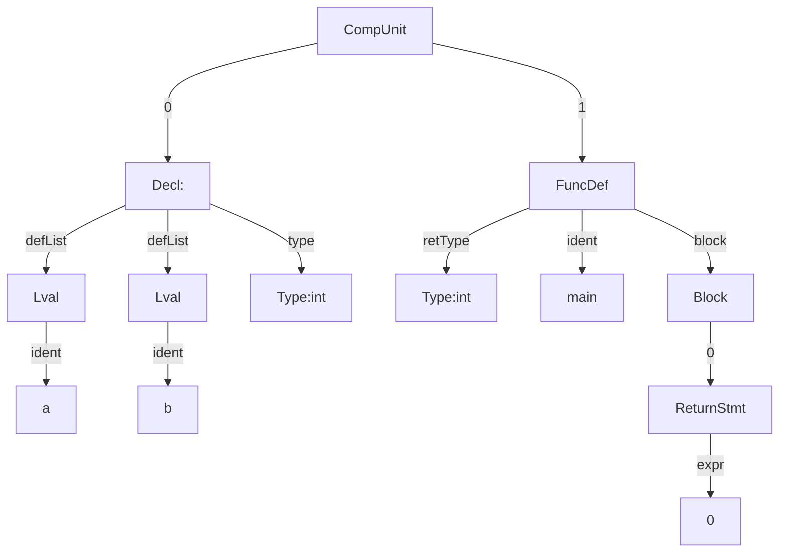

```mermaid
graph TD
13[CompUnit]--0--->5
5[Decl:]
5--type-->6
6[Type:int]
5--defList-->2
2[Lval]
2--ident-->1
1[a]
5--defList-->4
4[Lval]
4--ident-->3
3[b]
13[CompUnit]--1--->12
12[FuncDef]
12--retType-->7
7[Type:int]
12--ident-->8
8[main]
12--block-->11
11[Block]
11--0-->10
10[ReturnStmt]
10--expr-->9
9[0]
```
