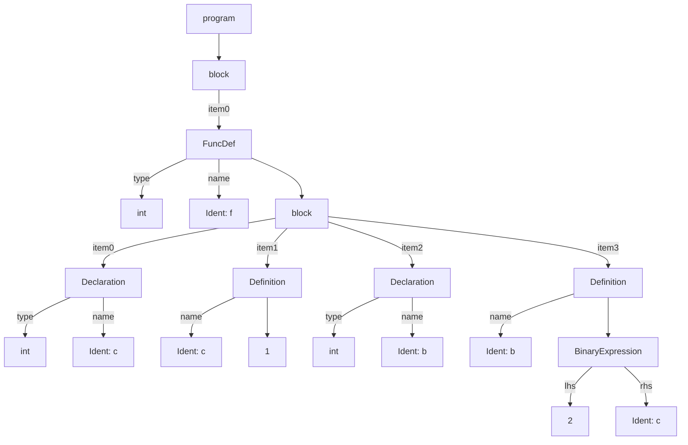

detect a vardef
detect a vardef

```mermaid
graph TD
16[program]
16-->17
17[block]
17--item0-->15
15[FuncDef]
15--type-->32[int]
15--name-->1
1[Ident: f]
15-->14
14[block]
14--item0-->6
6[Declaration]
6--type-->23[int]
6--name-->5
5[Ident: c]
14--item1-->4
4[Definition]
4--name-->2
2[Ident: c]
4-->3
3[1]
14--item2-->13
13[Declaration]
13--type-->30[int]
13--name-->12
12[Ident: b]
14--item3-->11
11[Definition]
11--name-->7
7[Ident: b]
11-->10
10[BinaryExpression]
10--lhs-->8
10--rhs-->9
8[2]
9[Ident: c]
```

```mermaid
graph TD
16[program]
16-->17
17[block]
17--item0-->15
15[FuncDef]
15--type-->32[int]
15--name-->1
1[Ident: f]
15-->14
14[block]
14--item0-->6
6[Declaration]
6--type-->23[int]
6--name-->5
5[Ident: c]
14--item1-->4
4[Definition]
4--name-->2
2[Ident: c]
4-->3
3[1]
14--item2-->13
13[Declaration]
13--type-->30[int]
13--name-->12
12[Ident: b]
14--item3-->11
11[Definition]
11--name-->7
7[Ident: b]
11-->10
10[BinaryExpression]
10--lhs-->8
10--rhs-->9
8[2]
9[Ident: c]
```
