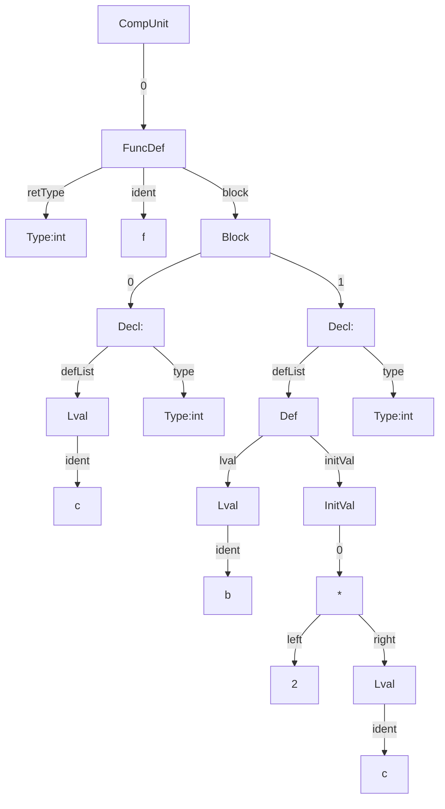

```mermaid
graph TD
20[CompUnit]--0--->19
19[FuncDef]
19--retType-->0
0[Type:int]
19--ident-->1
1[f]
19--block-->18
18[Block]
18--0-->5
5[Decl:]
5--type-->6
6[Type:int]
5--defList-->4
4[Lval]
4--ident-->3
3[c]
18--1-->16
16[Decl:]
16--type-->17
17[Type:int]
16--defList-->15
15[Def]
15--lval-->9
9[Lval]
9--ident-->8
8[b]
15--initVal-->14
14[InitVal]
14--0-->13
13["*"]
13--left-->10
10[2]
13--right-->12
12[Lval]
12--ident-->11
11[c]
```
