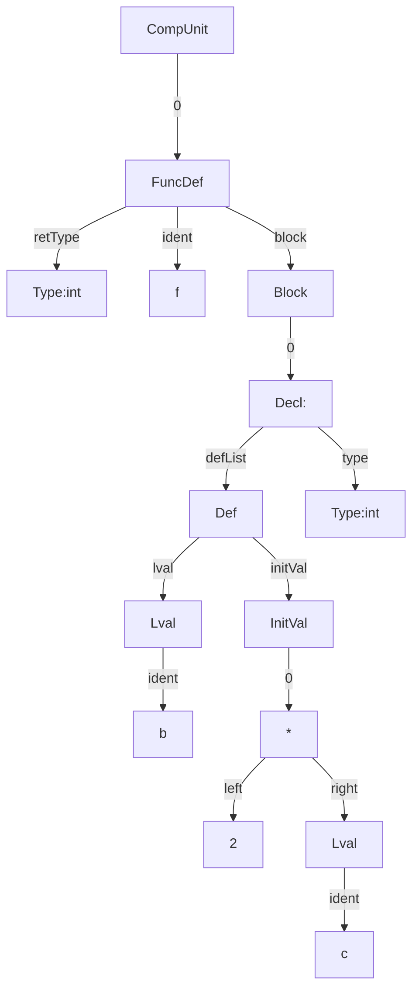

```mermaid
graph TD
15[CompUnit]--0--->14
14[FuncDef]
14--retType-->0
0[Type:int]
14--ident-->1
1[f]
14--block-->13
13[Block]
13--0-->11
11[Decl:]
11--type-->12
12[Type:int]
11--defList-->10
10[Def]
10--lval-->4
4[Lval]
4--ident-->3
3[b]
10--initVal-->9
9[InitVal]
9--0-->8
8["*"]
8--left-->5
5[2]
8--right-->7
7[Lval]
7--ident-->6
6[c]
```
