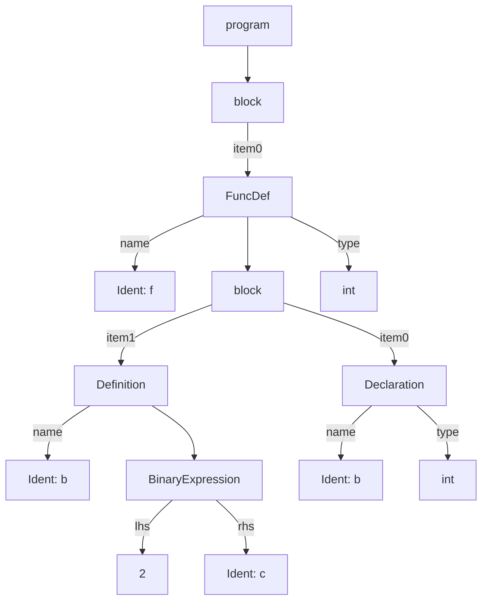

detect a vardef

```mermaid
graph TD
11[program]
11-->12
12[block]
12--item0-->10
10[FuncDef]
10--type-->22[int]
10--name-->1
1[Ident: f]
10-->9
9[block]
9--item0-->8
8[Declaration]
8--type-->20[int]
8--name-->7
7[Ident: b]
9--item1-->6
6[Definition]
6--name-->2
2[Ident: b]
6-->5
5[BinaryExpression]
5--lhs-->3
5--rhs-->4
3[2]
4[Ident: c]
```

```mermaid
graph TD
11[program]
11-->12
12[block]
12--item0-->10
10[FuncDef]
10--type-->22[int]
10--name-->1
1[Ident: f]
10-->9
9[block]
9--item0-->8
8[Declaration]
8--type-->20[int]
8--name-->7
7[Ident: b]
9--item1-->6
6[Definition]
6--name-->2
2[Ident: b]
6-->5
5[BinaryExpression]
5--lhs-->3
5--rhs-->4
3[2]
4[Ident: c]
```
