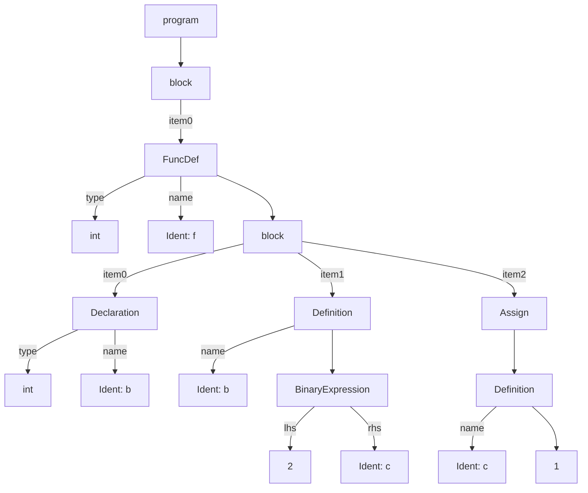

detect a vardef
detect a assignment

```mermaid
graph TD
15[program]
15-->16
16[block]
16--item0-->14
14[FuncDef]
14--type-->30[int]
14--name-->1
1[Ident: f]
14-->13
13[block]
13--item0-->8
8[Declaration]
8--type-->24[int]
8--name-->7
7[Ident: b]
13--item1-->6
6[Definition]
6--name-->2
2[Ident: b]
6-->5
5[BinaryExpression]
5--lhs-->3
5--rhs-->4
3[2]
4[Ident: c]
13--item2-->11
11[Assign]
11-->12
12[Definition]
12--name-->9
9[Ident: c]
12-->10
10[1]
```

```mermaid
graph TD
15[program]
15-->16
16[block]
16--item0-->14
14[FuncDef]
14--type-->30[int]
14--name-->1
1[Ident: f]
14-->13
13[block]
13--item0-->8
8[Declaration]
8--type-->24[int]
8--name-->7
7[Ident: b]
13--item1-->6
6[Definition]
6--name-->2
2[Ident: b]
6-->5
5[BinaryExpression]
5--lhs-->3
5--rhs-->4
3[2]
4[Ident: c]
13--item2-->11
11[Assign]
11-->12
12[Definition]
12--name-->9
9[Ident: c]
12-->10
10[1]
```
