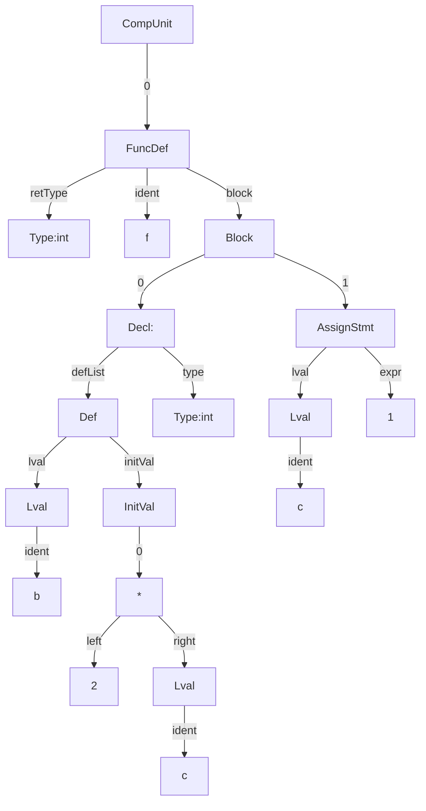

```mermaid
graph TD
19[CompUnit]--0--->18
18[FuncDef]
18--retType-->0
0[Type:int]
18--ident-->1
1[f]
18--block-->17
17[Block]
17--0-->11
11[Decl:]
11--type-->12
12[Type:int]
11--defList-->10
10[Def]
10--lval-->4
4[Lval]
4--ident-->3
3[b]
10--initVal-->9
9[InitVal]
9--0-->8
8["*"]
8--left-->5
5[2]
8--right-->7
7[Lval]
7--ident-->6
6[c]
17--1-->16
16[AssignStmt]
16--lval-->14
14[Lval]
14--ident-->13
13[c]
16--expr-->15
15[1]
```
