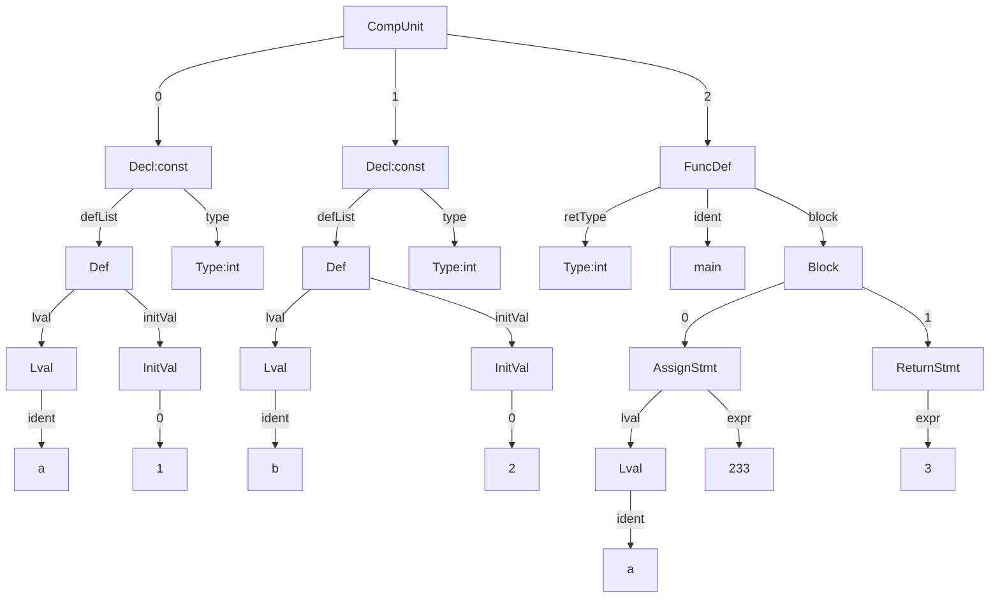

```mermaid
graph TD
30[CompUnit]--0--->6
6[Decl:const ]
6--type-->7
7[Type:int]
6--defList-->5
5[Def]
5--lval-->2
2[Lval]
2--ident-->1
1[a]
5--initVal-->4
4[InitVal]
4--0-->3
3[1]
30[CompUnit]--1--->14
14[Decl:const ]
14--type-->15
15[Type:int]
14--defList-->13
13[Def]
13--lval-->10
10[Lval]
10--ident-->9
9[b]
13--initVal-->12
12[InitVal]
12--0-->11
11[2]
30[CompUnit]--2--->29
29[FuncDef]
29--retType-->16
16[Type:int]
29--ident-->17
17[main]
29--block-->28
28[Block]
28--0-->21
21[AssignStmt]
21--lval-->19
19[Lval]
19--ident-->18
18[a]
21--expr-->20
20[233]
28--1-->27
27[ReturnStmt]
27--expr-->34
34[3]
```
