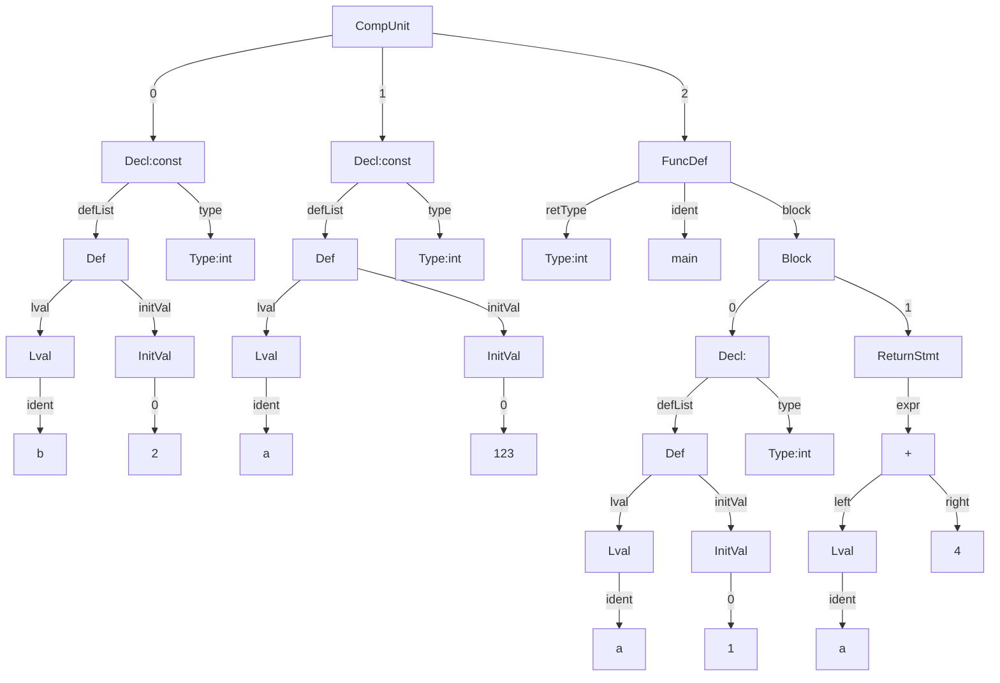

```mermaid
graph TD
36[CompUnit]--0--->6
6[Decl:const ]
6--type-->7
7[Type:int]
6--defList-->5
5[Def]
5--lval-->2
2[Lval]
2--ident-->1
1[b]
5--initVal-->4
4[InitVal]
4--0-->3
3[2]
36[CompUnit]--1--->14
14[Decl:const ]
14--type-->15
15[Type:int]
14--defList-->13
13[Def]
13--lval-->10
10[Lval]
10--ident-->9
9[a]
13--initVal-->12
12[InitVal]
12--0-->11
11[123]
36[CompUnit]--2--->35
35[FuncDef]
35--retType-->16
16[Type:int]
35--ident-->17
17[main]
35--block-->34
34[Block]
34--0-->24
24[Decl:]
24--type-->25
25[Type:int]
24--defList-->23
23[Def]
23--lval-->20
20[Lval]
20--ident-->19
19[a]
23--initVal-->22
22[InitVal]
22--0-->21
21[1]
34--1-->33
33[ReturnStmt]
33--expr-->32
32["+"]
32--left-->27
27[Lval]
27--ident-->26
26[a]
32--right-->38
38[4]
```
