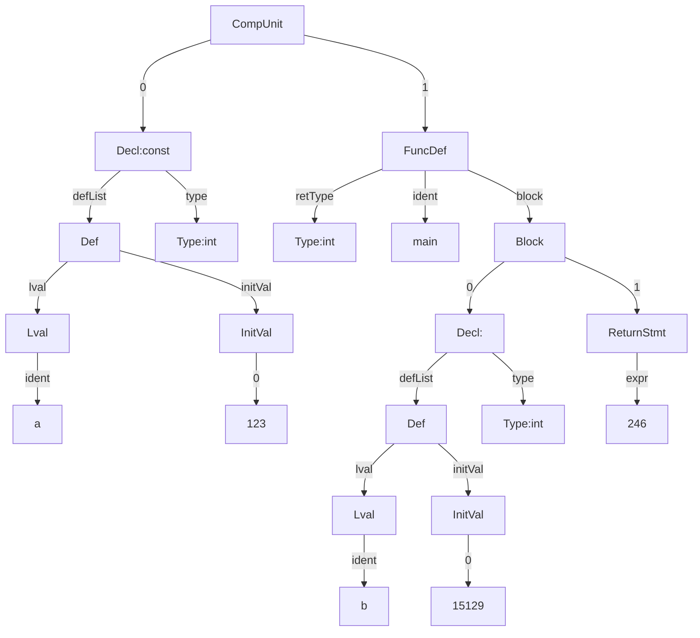

/app/build/sed
/app/tests/Decl-1/in.sy
/app/tests/Decl-1/out.md
/app/tests/Decl-1/error.txt
/app/tests/Decl-1/out.ll

```mermaid
graph TD
30[CompUnit]--0--->6
6[Decl:const ]
6--type-->7
7[Type:int]
6--defList-->5
5[Def]
5--lval-->2
2[Lval]
2--ident-->1
1[a]
5--initVal-->4
4[InitVal]
4--0-->3
3[123]
30[CompUnit]--1--->29
29[FuncDef]
29--retType-->8
8[Type:int]
29--ident-->9
9[main]
29--block-->28
28[Block]
28--0-->20
20[Decl:]
20--type-->21
21[Type:int]
20--defList-->19
19[Def]
19--lval-->12
12[Lval]
12--ident-->11
11[b]
19--initVal-->18
18[InitVal]
18--0-->34
34[15129]
28--1-->27
27[ReturnStmt]
27--expr-->38
38[246]
```
