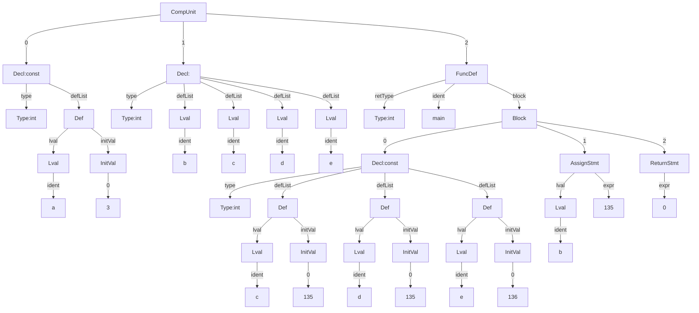

```mermaid
graph TD
61[CompUnit]--0--->6
6[Decl:const ]
6--type-->7
7[Type:int]
6--defList-->5
5[Def]
5--lval-->2
2[Lval]
2--ident-->1
1[a]
5--initVal-->4
4[InitVal]
4--0-->3
3[3]
61[CompUnit]--1--->17
17[Decl:]
17--type-->18
18[Type:int]
17--defList-->10
10[Lval]
10--ident-->9
9[b]
17--defList-->12
12[Lval]
12--ident-->11
11[c]
17--defList-->14
14[Lval]
14--ident-->13
13[d]
17--defList-->16
16[Lval]
16--ident-->15
15[e]
61[CompUnit]--2--->60
60[FuncDef]
60--retType-->19
19[Type:int]
60--ident-->20
20[main]
60--block-->59
59[Block]
59--0-->50
50[Decl:const ]
50--type-->51
51[Type:int]
50--defList-->35
35[Def]
35--lval-->23
23[Lval]
23--ident-->22
22[c]
35--initVal-->34
34[InitVal]
34--0-->68
68[135]
50--defList-->41
41[Def]
41--lval-->37
37[Lval]
37--ident-->36
36[d]
41--initVal-->40
40[InitVal]
40--0-->70
70[135]
50--defList-->49
49[Def]
49--lval-->43
43[Lval]
43--ident-->42
42[e]
49--initVal-->48
48[InitVal]
48--0-->73
73[136]
59--1-->56
56[AssignStmt]
56--lval-->53
53[Lval]
53--ident-->52
52[b]
56--expr-->75
75[135]
59--2-->58
58[ReturnStmt]
58--expr-->57
57[0]
```
