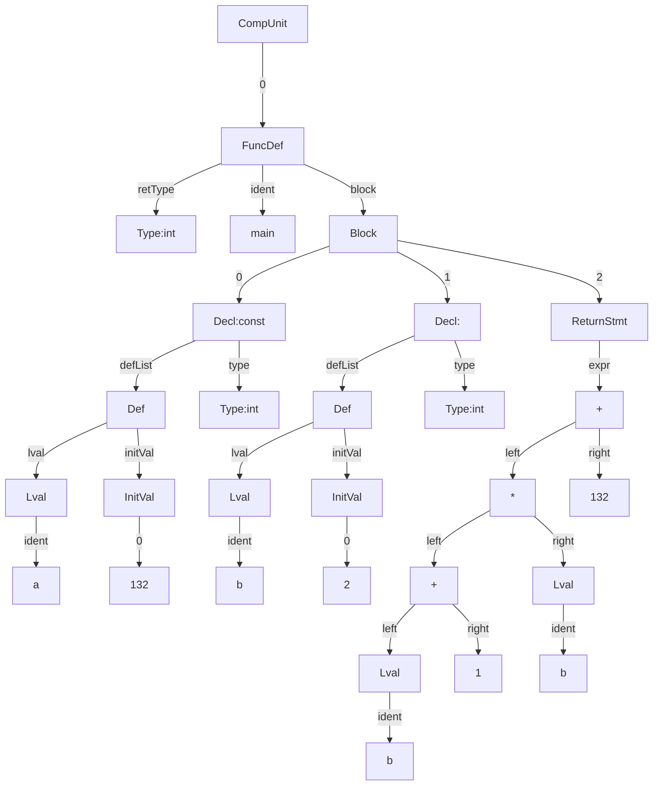

```mermaid
graph TD
31[CompUnit]--0--->30
30[FuncDef]
30--retType-->0
0[Type:int]
30--ident-->1
1[main]
30--block-->29
29[Block]
29--0-->8
8[Decl:const ]
8--type-->9
9[Type:int]
8--defList-->7
7[Def]
7--lval-->4
4[Lval]
4--ident-->3
3[a]
7--initVal-->6
6[InitVal]
6--0-->5
5[132]
29--1-->16
16[Decl:]
16--type-->17
17[Type:int]
16--defList-->15
15[Def]
15--lval-->12
12[Lval]
12--ident-->11
11[b]
15--initVal-->14
14[InitVal]
14--0-->13
13[2]
29--2-->28
28[ReturnStmt]
28--expr-->27
27["+"]
27--left-->24
24["*"]
24--left-->21
21["+"]
21--left-->19
19[Lval]
19--ident-->18
18[b]
21--right-->20
20[1]
24--right-->23
23[Lval]
23--ident-->22
22[b]
27--right-->32
32[132]
```
