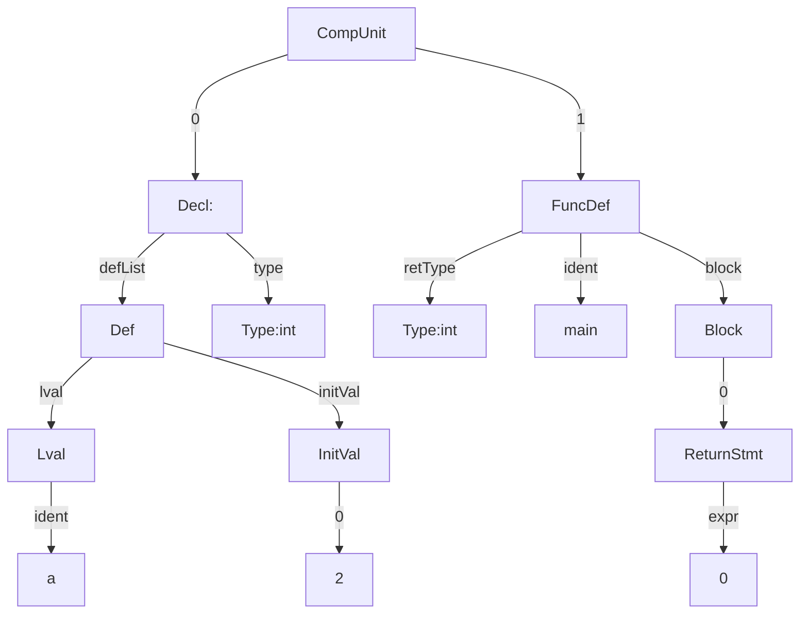

/app/build/sed
/app/tests/Decl-2/in.sy
/app/tests/Decl-2/out.md
/app/tests/Decl-2/error.txt
/app/tests/Decl-2/out.ll

```mermaid
graph TD
14[CompUnit]--0--->6
6[Decl:]
6--type-->7
7[Type:int]
6--defList-->5
5[Def]
5--lval-->2
2[Lval]
2--ident-->1
1[a]
5--initVal-->4
4[InitVal]
4--0-->3
3[2]
14[CompUnit]--1--->13
13[FuncDef]
13--retType-->8
8[Type:int]
13--ident-->9
9[main]
13--block-->12
12[Block]
12--0-->11
11[ReturnStmt]
11--expr-->10
10[0]
```
