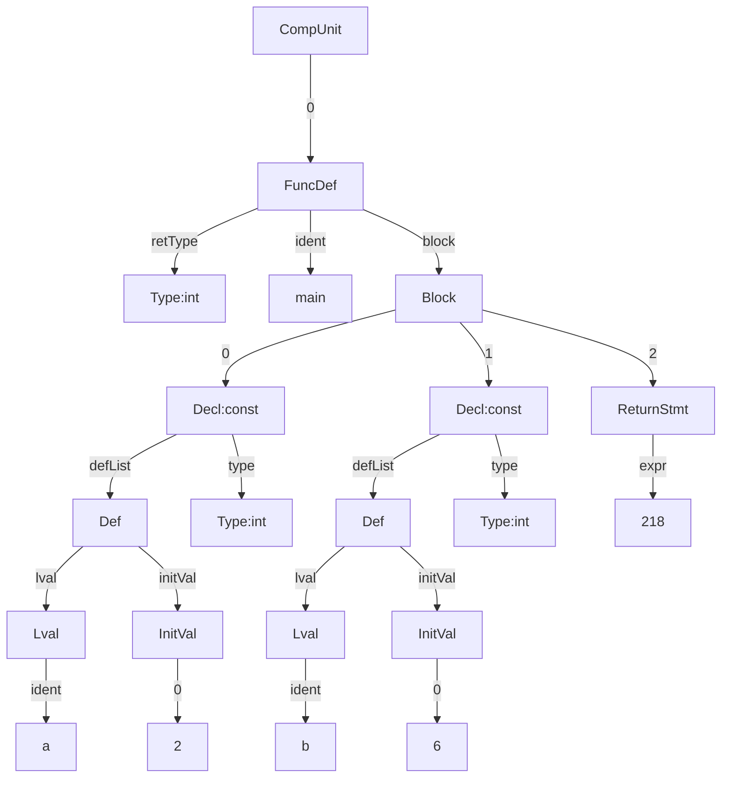

```mermaid
graph TD
39[CompUnit]--0--->38
38[FuncDef]
38--retType-->0
0[Type:int]
38--ident-->1
1[main]
38--block-->37
37[Block]
37--0-->8
8[Decl:const ]
8--type-->9
9[Type:int]
8--defList-->7
7[Def]
7--lval-->4
4[Lval]
4--ident-->3
3[a]
7--initVal-->6
6[InitVal]
6--0-->5
5[2]
37--1-->23
23[Decl:const ]
23--type-->24
24[Type:int]
23--defList-->22
22[Def]
22--lval-->12
12[Lval]
12--ident-->11
11[b]
22--initVal-->21
21[InitVal]
21--0-->45
45[6]
37--2-->36
36[ReturnStmt]
36--expr-->53
53[218]
```
