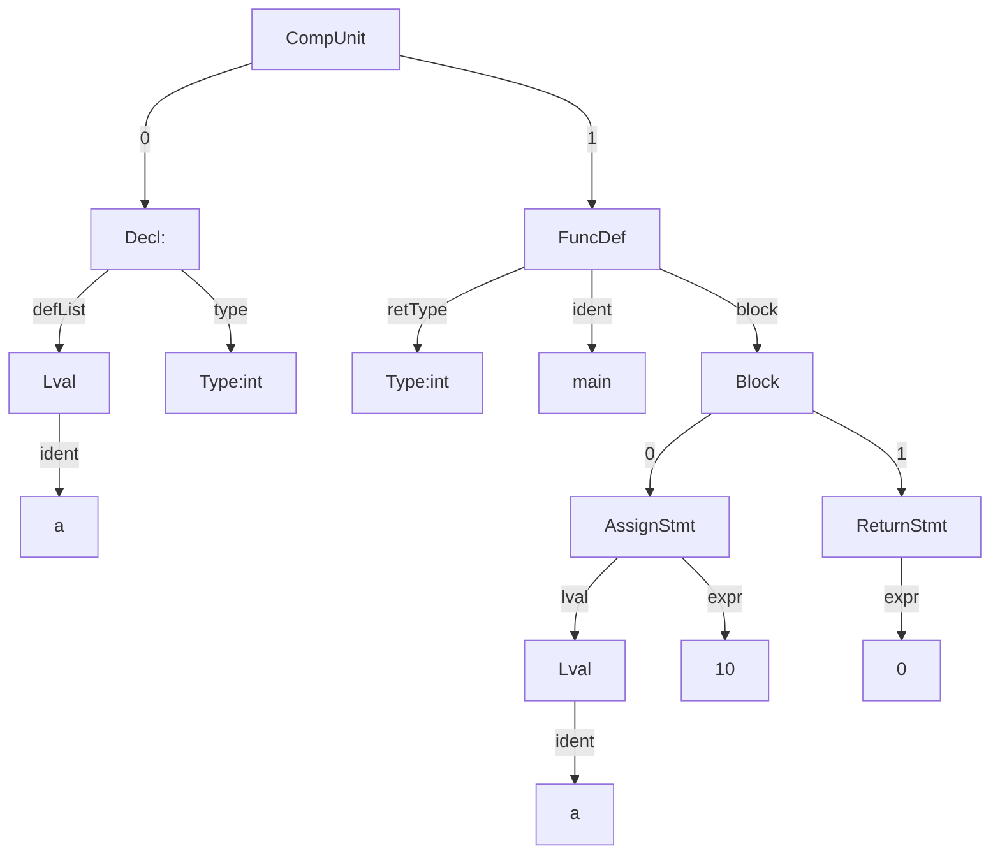

```mermaid
graph TD
15[CompUnit]--0--->3
3[Decl:]
3--type-->4
4[Type:int]
3--defList-->2
2[Lval]
2--ident-->1
1[a]
15[CompUnit]--1--->14
14[FuncDef]
14--retType-->5
5[Type:int]
14--ident-->6
6[main]
14--block-->13
13[Block]
13--0-->10
10[AssignStmt]
10--lval-->8
8[Lval]
8--ident-->7
7[a]
10--expr-->9
9[10]
13--1-->12
12[ReturnStmt]
12--expr-->11
11[0]
```
