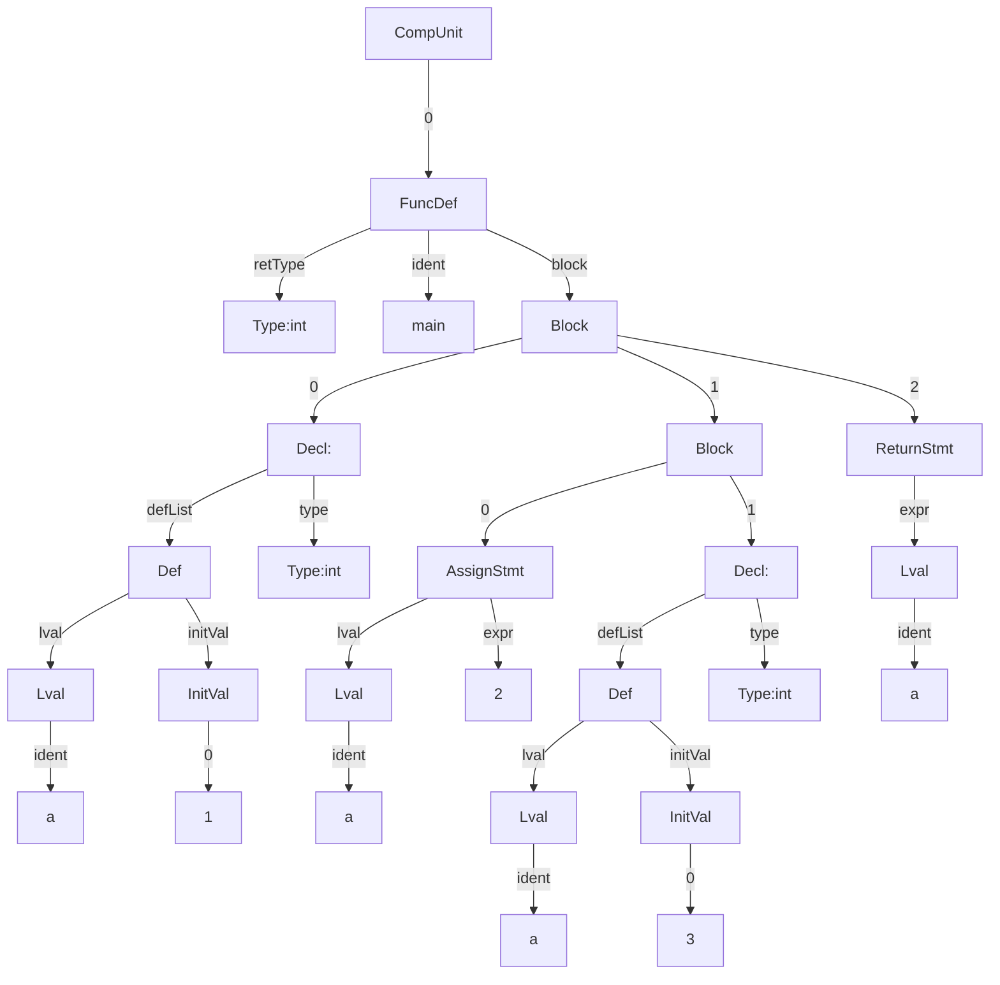

```mermaid
graph TD
28[CompUnit]--0--->27
27[FuncDef]
27--retType-->0
0[Type:int]
27--ident-->1
1[main]
27--block-->26
26[Block]
26--0-->8
8[Decl:]
8--type-->9
9[Type:int]
8--defList-->7
7[Def]
7--lval-->4
4[Lval]
4--ident-->3
3[a]
7--initVal-->6
6[InitVal]
6--0-->5
5[1]
26--1-->22
22[Block]
22--0-->13
13[AssignStmt]
13--lval-->11
11[Lval]
11--ident-->10
10[a]
13--expr-->12
12[2]
22--1-->20
20[Decl:]
20--type-->21
21[Type:int]
20--defList-->19
19[Def]
19--lval-->16
16[Lval]
16--ident-->15
15[a]
19--initVal-->18
18[InitVal]
18--0-->17
17[3]
26--2-->25
25[ReturnStmt]
25--expr-->24
24[Lval]
24--ident-->23
23[a]
```
