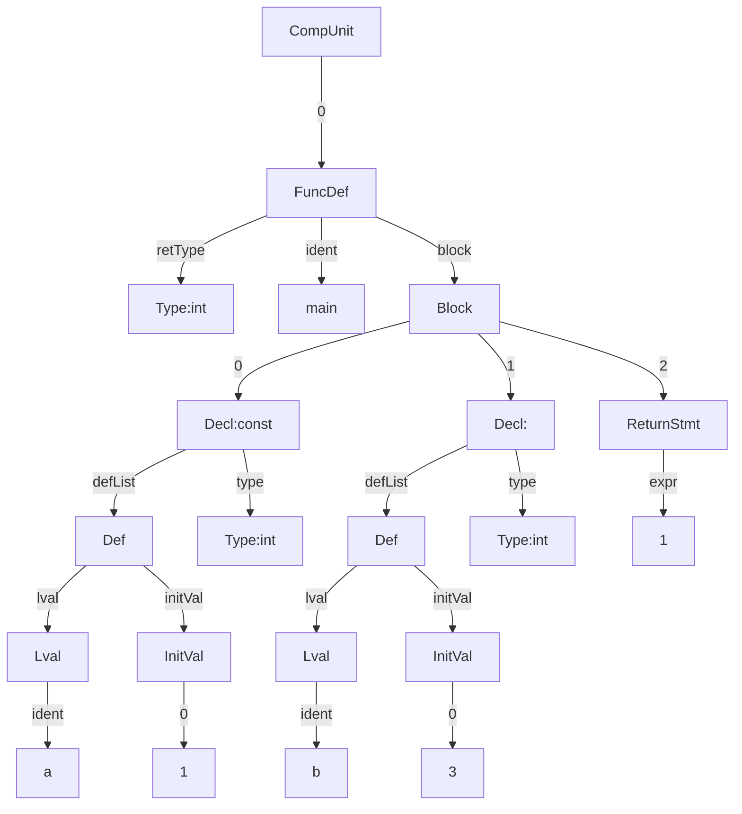

```mermaid
graph TD
26[CompUnit]--0--->25
25[FuncDef]
25--retType-->0
0[Type:int]
25--ident-->1
1[main]
25--block-->24
24[Block]
24--0-->8
8[Decl:const ]
8--type-->9
9[Type:int]
8--defList-->7
7[Def]
7--lval-->4
4[Lval]
4--ident-->3
3[a]
7--initVal-->6
6[InitVal]
6--0-->5
5[1]
24--1-->19
19[Decl:]
19--type-->20
20[Type:int]
19--defList-->18
18[Def]
18--lval-->12
12[Lval]
12--ident-->11
11[b]
18--initVal-->17
17[InitVal]
17--0-->29
29[3]
24--2-->23
23[ReturnStmt]
23--expr-->31
31[1]
```
